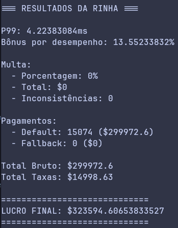

# Rinha de Backend Rust - 2025 🦀

Minha versão em Rust com o framework web Axum para a rinha de backend - 2025 (feito dias depois da competição ter acabado, apenas uma desculpa para experimentar o framework Axum e estudar multithreading com o runtime Tokio).

## Ferramentas usadas

- Rust v1.88
- Axum v0.8.4
- Tokio v1.0.0
- Redis v7.2
- Nginx v1.25

## Melhores resultados obtidos até agora (finalmente sem inconsistências 🙌)



## Como iniciar

Ambos os diretórios /payment-processor e /rinha-test (pertencentes ao repositõrio oficial da rinha) devem estar clonados na raiz deste projeto.

### Iniciar o serviço de pagamentos

```bash
cd ./payment-processor

docker compose up
```

### Iniciar os testes da API localmente

```bash
docker compose -f docker-compose.dev.yml up

./run_local_test.sh
```

----------
Released in 2025

By [Victor B. Fiamoncini](https://github.com/Victor-Fiamoncini) ☕️
